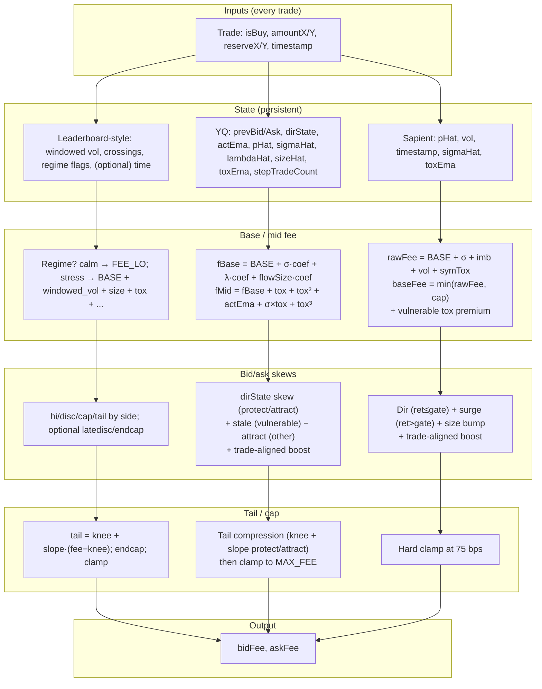

# AMM Fee Strategy: Leaderboard vs YQ vs Sapient — Comparison Report

**Date:** 2025-02-10  
**Purpose:** Understand what top strategies and YQ do that we are missing, to improve our edge from ~380 toward 526.  
**Audience:** Strategy design and next implementation steps.

---

## 1. Executive Summary

| Source | Edge (approx) | Base idea |
|--------|----------------|-----------|
| **Leaderboard top** | ~526 | Multi-regime, windowed features (vol/crossings), tail & time handling, many tuned params |
| **YQ (reference)** | ~520 | 3 bps base + build-up; activity/flow in base; first-in-step; tail compression; dirState; pImplied |
| **Sapient (V20/V21)** | ~380 | 8 bps additive base; sigma/imb/vol/symTox; vulnerable-side tox; dir; surge; size bump; trade-aligned boost; **hard 75 bps cap** |

**Gap:** ~146 points. Main structural gaps: **(1)** no activity/flow in base (lambdaHat, sizeHat, flowSize), **(2)** hard cap instead of tail compression, **(3)** no first-in-step that works in this sim (we tried; it regressed), **(4)** no dirState/stale+attract on our current 8 bps base (V8 had them on 35 bps and regressed). **Next best bet:** tail compression on V20 (like V15), then two regimes or activity/flow on V14 base.

---

## 2. Side-by-Side Comparison Table

| Concept | Leaderboard (from names) | YQ | Sapient (V20/V21) |
|---------|---------------------------|-----|-------------------|
| **Base fee level** | Low + build-up (disc/hi) | 3 bps | 8 bps |
| **Base formula** | Multi-regime (calm vs stress) | BASE + σ + λ + flowSize | BASE + σ + imb + vol + symTox |
| **Activity in base** | Yes (feW10, cross5, cand) | lambdaHat, sizeHat, flowSize, actEma | No |
| **Volatility signal** | Windowed (e.g. 5–10) | sigmaHat (first-in-step) | sigmaHat every trade, vol EMA |
| **Price signal** | — | pImplied (fee-adjusted) | spot → pHat (no pImplied) |
| **First-in-step** | Implied (cross/window) | pHat dual alpha, sigma only first | Tried; regressed to 128 → reverted |
| **Toxicity** | Multi-feature / regime | tox + sigma×tox + cubic | tox linear+quad + sym + vulnerable-side |
| **Direction / flow memory** | — | dirState (protect/attract) | Dir premium (ret ≤ gate only), no state |
| **Stale + attract** | — | Yes (staleShift, attractShift) | No (V8 had it; regressed) |
| **Trade-aligned boost** | — | Yes (size-scaled) | Yes (size-scaled, cap 25 bps) |
| **Tail / cap** | tail2c220, endcap33, cap29 | Tail compression (knee + slope) | Hard 75 bps cap |
| **Time / episode** | latedisc16, endcap33 | — | No |
| **Surge on gate breach** | — | No (gate for pHat only) | Yes (15–40 bps) |
| **Slots (persistent)** | — | 11 (prev fees, dirState, λ, size, act, stepCount, …) | 5 (pHat, vol, ts, σ, tox) |

---

## 3. What We Have vs What We’re Missing

### 3.1 What we have (Sapient V20/V21)

- **Low additive base (8 bps)**  
  BASE_LOW + σ×coef + imbalance×coef + vol×coef + symmetric tox (linear + quad + SYM_HIGH above 1.5%). Floor and time-decay toward floor. Good for “build up” in stress.

- **Vulnerable-side toxicity**  
  Tox premium (linear + quad) on the side with more inventory risk; asymmetry (e.g. +60%) on that side.

- **Directionality (no state)**  
  When ret ≤ gate and ret ≥ 0.5%, add a premium to the “wrong” side (spot vs pHat), capped (e.g. 30 bps). No memory of who hit us.

- **Surge on gate breach**  
  When ret > gate, add 15–40 bps to the trade side. Complements the gate.

- **Trade-size bump**  
  Size-scaled add-on (capped) on the side hit. Per-trade only.

- **Trade-aligned toxicity boost**  
  If current trade is toxic (buy when spot ≥ pHat or sell when spot < pHat), add size-scaled boost (cap 25 bps) to that side. Matches YQ idea.

- **Single alpha, sigma every trade**  
  pHat and sigmaHat updated on every trade; no step-based logic in production (first-in-step reverted).

- **Hard cap**  
  All fees clamped at 75 bps. Simple but clips margin in the tail.

### 3.2 What we’re missing (and why it matters)

- **Activity/flow in base**  
  No lambdaHat (trades per step), sizeHat (smoothed trade size), or flowSize (λ×size). In bursts of many trades per step we undercharge intensity vs YQ and leaderboard-style strategies.

- **Tail compression**  
  Hard cap removes gradient above 75 bps; cap arbitrage possible. YQ and leaderboard use knee + slope (and sometimes endcap/late logic) to keep charging in the tail without a flat ceiling.

- **First-in-step (working)**  
  We tried first-in-step pHat/sigma; edge fell to 128. So in this sim we don’t have a working first-in-step; the concept exists in YQ and is hinted on the leaderboard.

- **dirState (flow-direction memory)**  
  No persistent “who’s been hitting us” state. YQ uses dirState to protect the side under pressure and attract the other; we only have one-shot directionality from current ret.

- **Stale + attract**  
  No explicit “stale” add-on to vulnerable side and “attract” discount on the other. V8 had it on a different base and regressed; we haven’t tried it on the 8 bps additive base.

- **pImplied**  
  We use spot for ret and pHat update. YQ uses fee-adjusted implied price (pImplied) so one toxic trade doesn’t drag pHat too much. We have no pImplied in current V20/V21.

- **Multi-regime / time**  
  No explicit “calm vs stress” switch (e.g. flat low fee in calm, full pipeline in stress). No end-of-sim or “late” discount/endcap like in leaderboard names.

- **Sigma×tox and cubic tox**  
  We had them in V19 (and V8); on V14 base they didn’t move edge (380.13). So we have the formula available but not a big lever in isolation.

---

## 4. Detailed Diagram: AMM Fee Strategy Flow

### 4.0 Generic AMM fee pipeline (any strategy)

Every strategy in this challenge follows the same high-level pipeline: **trade + persistent state** → **update state & compute signals** → **base/mid fee** → **bid/ask skews** → **tail/cap** → **output**. The following diagram is the template; each strategy fills the boxes differently.

```
                    ┌──────────────────────────────────────────────────────────┐
                    │                   PERSISTENT STATE                        │
                    │  (pHat, sigma, vol, tox, …; YQ adds λ, size, dirState)   │
                    └─────────────────────────┬────────────────────────────────┘
                                              │
  ┌─────────────┐                             │
  │   TRADE     │─────────────────────────────┤
  │ reserveX/Y  │                             ▼
  │ amountX/Y   │              ┌──────────────────────────────────────────────┐
  │ isBuy       │              │  SIGNALS (per trade)                         │
  │ timestamp   │              │  spot, ret, gate, firstInStep?, tradeRatio…   │
  └─────────────┘              └──────────────────────────┬───────────────────┘
                                              │
                                              ▼
                    ┌──────────────────────────────────────────────────────────┐
                    │  BASE / MID FEE                                          │
                    │  base = f(σ, imb, vol, tox, …); YQ adds λ, flowSize, act │
                    └─────────────────────────┬────────────────────────────────┘
                                              │
                                              ▼
                    ┌──────────────────────────────────────────────────────────┐
                    │  BID vs ASK SKEWS                                         │
                    │  who is vulnerable? dir? surge? trade-aligned? stale?     │
                    └─────────────────────────┬────────────────────────────────┘
                                              │
                                              ▼
                    ┌──────────────────────────────────────────────────────────┐
                    │  TAIL / CAP                                               │
                    │  hard cap (us) vs knee+slope compression (YQ, leaderboard) │
                    └─────────────────────────┬────────────────────────────────┘
                                              │
                                              ▼
                                    ┌─────────────────┐
                                    │  bidFee, askFee │
                                    └─────────────────┘
```

---

The next diagram compares **Leaderboard-style**, **YQ**, and **Sapient (V20)** in one flowchart.



### 4.1 Same flow, linear view (Sapient V20)

```
Trade (reserveX/Y, amountY, isBuy, timestamp)
    │
    ▼
┌─────────────────────────────────────────────────────────────────┐
│ STATE READ: pHat, vol, lastTs, sigmaHat, toxEma                  │
└─────────────────────────────────────────────────────────────────┘
    │
    ▼
┌─────────────────────────────────────────────────────────────────┐
│ SPOT = reserveY/reserveX   RET = |spot−pHat|/pHat (capped)       │
│ Gate = sigma×10 (min 3%)   Update pHat if ret≤gate (α=0.26)      │
│ Update sigmaHat, vol (EMA), toxEma                               │
└─────────────────────────────────────────────────────────────────┘
    │
    ▼
┌─────────────────────────────────────────────────────────────────┐
│ BASE: rawFee = 8bps + σ·coef + imb·coef + vol·coef + symTox      │
│       + floor(imbalance) + decay toward floor if time advanced    │
│ baseFee = min(rawFee, 75bps)                                     │
│ + tox premium (linear+quad) on VULNERABLE side (×1.6)             │
└─────────────────────────────────────────────────────────────────┘
    │
    ▼
┌─────────────────────────────────────────────────────────────────┐
│ SKEWS: Dir (if ret≤gate, ret≥0.5%) → wrong side +premium (cap)   │
│        Surge (if ret>gate) → trade side +15..40 bps               │
│        Size bump → trade side (cap 20 bps)                        │
│        Trade-aligned boost (if toxic) → that side (cap 25 bps)    │
└─────────────────────────────────────────────────────────────────┘
    │
    ▼
┌─────────────────────────────────────────────────────────────────┐
│ CAP: bidFee = min(75 bps, bidFee)   askFee = min(75 bps, askFee) │
└─────────────────────────────────────────────────────────────────┘
    │
    ▼
  (bidFee, askFee)
```

### 4.2 YQ flow (concise)

```
Trade + State (prevBid/Ask, dirState, actEma, pHat, sigmaHat, lambdaHat, sizeHat, toxEma, stepTradeCount)
    │
    ▼
New step? → decay dirState, actEma, sizeHat, toxEma; update lambdaHat from stepTradeCount; reset stepCount
firstInStep = (stepCount==0); stepCount++
pImplied from prev fee (gamma); ret from pImplied vs pHat
pHat update: alpha = firstInStep ? 0.26 : 0.05; sigma only if firstInStep
dirState push (buy/sell); actEma, sizeHat blend (if tradeRatio > threshold)
tox from spot vs pHat; toxEma blend
    │
    ▼
fBase = 3bps + σ·coef + λ·coef + flowSize·coef
fMid = fBase + tox + tox² + actEma + σ×tox + tox³
    │
    ▼
+ dirState skew (protect side +skew, attract −skew)
+ stale (vulnerable side) − attract (other)
+ trade-aligned boost
    │
    ▼
Tail compression (knee 5bps + slope 0.93/0.955 by side) → clamp
    │
    ▼
(bidFee, askFee)  and  persist all state
```

---

## 5. Recommendations to Improve Edge

1. **Tail compression (highest confidence)**  
   Replace hard 75 bps cap with knee (e.g. 5 bps) + slope (e.g. 0.93 protect, 0.955 attract), then clamp. No new slots. V15 already has this on V14; combine with V20’s trade-aligned boost and run (e.g. as V22).

2. **Two regimes**  
   If sigma and tox below thresholds → output flat low fee (e.g. 10–15 bps). Else → full V20 pipeline (optionally with tail compression). Targets retail in calm and protection in stress.

3. **Activity/flow on V14 base**  
   Add lambdaHat, stepTradeCount, sizeHat; on new step update lambda and decay sizeHat; add LAMBDA_COEF×lambdaHat and FLOW_SIZE_COEF×lambdaHat×sizeHat to base. Needs 2–3 slots and tuning; try after tail compression.

4. **Avoid (for now)**  
   First-in-step (regressed in our sim). dirState/stale+attract on top of V20 until we’ve tested tail and two regimes (V8 regressed when we added them on a different base).

---

## 6. References

- Leaderboard: https://www.ammchallenge.com/ (top strategy names reverse-engineered: multi-regime, windowed features, tail, time).
- YQ: `amm-challenge/contracts/src/refs/YQStrategy.sol`; `docs/2025-02-09-YQ-extract-for-Sapient.md`.
- Sapient: `SapientStrategyV20.sol`, `SapientStrategyV21.sol` (reverted to V20); `docs/2025-02-09-Sapient-audit-380-vs-526.md`, `docs/2025-02-10-Sapient-V20-amm-fee-designer-diagnosis.md`.

---

## Changelog

- **2025-02-10:** Report created: comparison table, missing vs present concepts, Mermaid + linear AMM fee strategy diagrams, recommendations.
